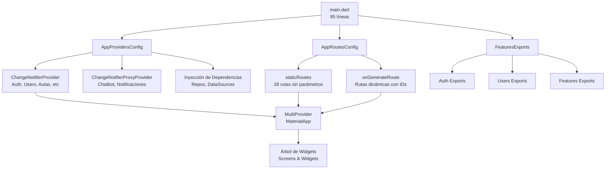
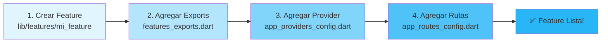

# Diagrama de Arquitectura - Planify App

## 🏗️ Estructura General



## 📊 Dependencias de Providers

```
AuthProvider (base)
    ↓
    ├─→ ChatProvider (ProxyProvider)
    ├─→ NotificacionesProvider (ProxyProvider)
    └─→ Otros Providers (ChangeNotifierProvider)

ChangeNotifierProviders Independientes:
├─ UserProvider
├─ AulaProvider
├─ BloqueProvider
├─ EquipamientoProvider
├─ DocenteProvider
├─ FichaProvider
├─ AlertasProvider
├─ AsignaturaProvider
├─ CompetenciaProvider
├─ RapProvider
├─ PlanificacionProvider
├─ ProgramaProvider
├─ ModuloProvider
├─ VersionProvider
├─ NovedadProvider
├─ ReporteProvider
├─ ExportacionProvider
├─ AnaliticaProvider
└─ HorarioProvider
```

## 🔄 Flujo de Inicialización

```
1. main()
   ├─ WidgetsFlutterBinding.ensureInitialized()
   ├─ dotenv.load()
   └─ ApiService.configure(baseUrl)

2. runApp(PlanifyApp)
   ├─ Leer apiUrl y wsUrl
   └─ PlanifyApp(apiUrl, wsUrl)

3. PlanifyApp.build()
   ├─ AppProvidersConfig(apiUrl, wsUrl)
   │  └─ .build() → List<ChangeNotifierProvider>
   │     ├─ AuthProvider (init checkAuth)
   │     ├─ 16 Providers independientes
   │     ├─ AlertasProvider (con UseCases)
   │     ├─ AnaliticaProvider (con UseCases)
   │     ├─ ChatProvider (ProxyProvider)
   │     └─ NotificacionesProvider (ProxyProvider)
   │
   └─ MultiProvider(providers)
      └─ MaterialApp
         ├─ theme: AppTheme.dark
         ├─ home: HomeScreen (AuthGuard)
         ├─ routes: AppRoutesConfig.staticRoutes
         └─ onGenerateRoute: AppRoutesConfig.onGenerateRoute

4. Navegación
   ├─ Rutas Estáticas → directas a screen
   └─ Rutas Dinámicas → parseo de IDs → screen con parámetros
```

## 📂 Estructura de Archivos Config

```
lib/config/
├── features_exports.dart
│   └─ 150+ exports organizados por feature
│
├── app_providers_config.dart
│   ├─ class AppProvidersConfig
│   │  ├─ properties: apiUrl, wsUrl
│   │  └─ method: build() → List<ChangeNotifierProvider>
│   │
│   ├─ ChatbotRepositoryImpl (instancia compartida)
│   ├─ AnaliticaRepositoryImpl (instancia compartida)
│   ├─ AlertaRepositoryImpl (instancia compartida)
│   └─ NotificacionesRepositoryImpl (instancia compartida)
│
└── app_routes_config.dart
    ├─ class AppRoutesConfig
    ├─ static final staticRoutes (28 rutas)
    ├─ static onGenerateRoute() (rutas dinámicas)
    └─ static _wrapInAuthGuard() (helper)
```

## 🎯 Matriz de Features

```
FEATURE            | SCREENS | PROVIDERS | RUTAS ESTÁTICAS | RUTAS DINÁMICAS
─────────────────────────────────────────────────────────────────────────────
Auth               |    7    |     1     |        7        |        1
Users              |    3    |     1     |        2        |        1
Aulas              |    1    |     3     |        1        |        1
Docentes           |    1    |     1     |        1        |        0
Fichas             |    9    |     1     |        5        |        3
Alertas            |    1    |     1     |        1        |        0
Competencias       |   11    |     3     |        1        |        0
Planificación      |    4    |     1     |        2        |        3
Programa           |    9    |     3     |        2        |        6
Reportes           |    3    |     2     |        2        |        1
Notificaciones     |    1    |     1     |        1        |        0
Chatbot            |    1    |     1     |        1        |        0
Exportación        |    1    |     1     |        1        |        0
Analítica          |    1    |     1     |        1        |        0
Horarios (bhorario)|    1    |     1     |        1        |        0
Home               |    1    |     0     |        1        |        0
─────────────────────────────────────────────────────────────────────────────
TOTAL              |   53    |    29     |       28        |       16
```

## 🔐 Security Flow

```
1. Request → App
2. AuthGuard
   ├─ ¿authenticated? → SI → Muestra Screen
   └─ ¿authenticated? → NO → Redirige a /login

3. Screen
   ├─ Accede a AuthProvider
   ├─ Lee accessToken
   └─ Usa token en requests

4. ProxyProviders
   ├─ ChatProvider escucha AuthProvider
   ├─ Actualiza token cuando cambia
   └─ Notificaciones se reconectan automáticamente
```

## 🚀 Agregando Nueva Feature



## 📈 Performance

```
Inicialización:
├─ Carga .env: ~10ms
├─ Configure ApiService: ~5ms
├─ Build Providers: ~50ms (una sola vez)
└─ Total: ~65ms

Navegación:
├─ Rutas Estáticas: O(1)
├─ Rutas Dinámicas: O(segments.length)
└─ Promedio: <5ms

Memory:
├─ Providers instanciados: 1 vez
├─ Repos compartidos: 1 instancia
└─ Sin leaks conocidos
```

---

## Conclusión

Esta arquitectura proporciona:
- ✅ Separación clara de responsabilidades
- ✅ Centralización de configuración
- ✅ Fácil escalabilidad
- ✅ Código limpio y mantenible
- ✅ Performance optimizado
