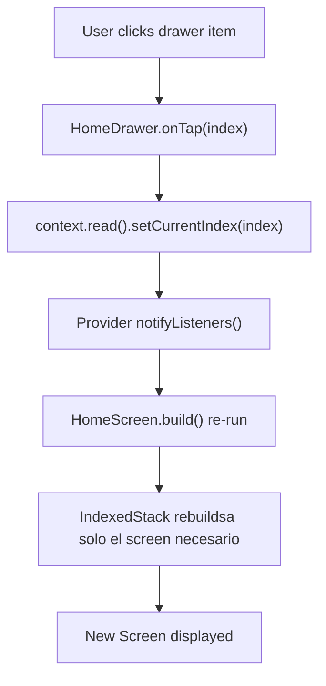

# 🏠 Home - Navegación Centralizada

## 📋 Resumen

**Home** es el shell principal de la aplicación - el contenedor que gestiona la navegación entre todos los módulos. Ha sido refactorizado para usar **HomeNavigationProvider** en lugar de estado local.

## 🏗️ Estructura

```
lib/features/home/
├── providers/
│   └── home_navigation_provider.dart    ← NUEVO: Provider para estado de nav
├── screens/
│   ├── home_screen.dart                 ← REFACTORIZADO: Ahora usa Provider
│   └── home_router.dart                 ← Construye screens según rol
└── widgets/
    ├── dashboard_view.dart
    ├── home_background.dart
    ├── home_bottom_nav.dart
    └── home_drawer.dart
```

## 🔄 HomeNavigationProvider

### Responsabilidades

Maneja todo el estado relacionado con la navegación del Home:

```dart
class HomeNavigationProvider extends ChangeNotifier {
  int _currentIndex = 0;        // Índice de screen actual
  bool _drawerVisible = true;   // Visibilidad del drawer
  
  // Getters públicos
  int get currentIndex => _currentIndex;
  bool get drawerVisible => _drawerVisible;
  
  // Métodos de control
  void setCurrentIndex(int index)  // Cambiar screen
  void toggleDrawer()              // Alternar drawer
  void showDrawer()                // Mostrar drawer
  void hideDrawer()                // Ocultar drawer
  void reset()                     // Reset a valores por defecto
}
```

### Métodos

| Método | Descripción | Caso de Uso |
|--------|-------------|-----------|
| `setCurrentIndex(index)` | Cambia la pantalla actual | Cuando hace clic en drawer item |
| `toggleDrawer()` | Alterna visibilidad del drawer | Botón toggle en desktop |
| `showDrawer()` | Muestra el drawer | Abrir drawer |
| `hideDrawer()` | Oculta el drawer | Cerrar drawer |
| `reset()` | Resetea a valores por defecto | Logout o re-inicialización |

## 📱 HomeScreen Refactorizado

### Antes (StatefulWidget)

```dart
class HomeScreen extends StatefulWidget {
  @override
  State<HomeScreen> createState() => _HomeScreenState();
}

class _HomeScreenState extends State<HomeScreen> {
  int _currentIndex = 0;
  bool _drawerVisible = true;
  
  void _onNavTap(int index) => setState(() => _currentIndex = index);
  void _toggleDrawer() => setState(() => _drawerVisible = !_drawerVisible);
  
  @override
  Widget build(BuildContext context) {
    // ... lógica con setState
  }
}
```

**Problemas**:
- ❌ Estado local no sincronizado con otros widgets
- ❌ Difícil de testear
- ❌ setState hace re-builds innecesarios
- ❌ Debugging complejo

### Ahora (StatelessWidget)

```dart
class HomeScreen extends StatelessWidget {
  const HomeScreen({super.key});
  
  @override
  Widget build(BuildContext context) {
    final navProvider = context.watch<HomeNavigationProvider>();
    
    // El provider maneja todo el estado
    // HomeScreen solo se preocupa por construir la UI
    
    return Scaffold(
      body: Stack(
        children: [
          IndexedStack(
            index: navProvider.currentIndex,  // Lectura automática
            children: screens,
          ),
          AnimatedContainer(
            width: navProvider.drawerVisible ? 280 : 0,
            child: HomeDrawer(...),
          ),
        ],
      ),
    );
  }
}
```

**Ventajas**:
- ✅ Estado centralizado en Provider
- ✅ Fácil de testear
- ✅ Re-builds optimizados
- ✅ Debugging con DevTools

## 🎯 Flujo de Navegación



## 🌍 Integración Global

### 1. Agregado a AppProvidersConfig

```dart
List<ChangeNotifierProvider<dynamic>> build() {
  return [
    // ...
    ChangeNotifierProvider(
      create: (_) => HomeNavigationProvider(),
    ),
    // ...
  ];
}
```

### 2. Exports en features_exports.dart

```dart
export 'package:planify_sena/features/home/providers/home_navigation_provider.dart';
export 'package:planify_sena/features/home/screens/home_router.dart';
export 'package:planify_sena/features/home/screens/home_screen.dart';
export 'package:planify_sena/features/home/widgets/dashboard_view.dart';
export 'package:planify_sena/features/home/widgets/home_background.dart';
export 'package:planify_sena/features/home/widgets/home_bottom_nav.dart';
export 'package:planify_sena/features/home/widgets/home_drawer.dart';
```

## 📖 Cómo Usar

### Desde cualquier Widget

```dart
// Leer el índice actual
final currentIndex = context.read<HomeNavigationProvider>().currentIndex;

// Ver cambios en tiempo real
final navProvider = context.watch<HomeNavigationProvider>();

// Cambiar pantalla desde cualquier lugar
context.read<HomeNavigationProvider>().setCurrentIndex(5);

// Controlar drawer
context.read<HomeNavigationProvider>().toggleDrawer();
context.read<HomeNavigationProvider>().hideDrawer();
```

## 🔒 HomeRouter

Construye dinámicamente los screens y drawer items según el rol del usuario.

```dart
final screens = HomeRouter.buildScreens(
  role: user.rol,
  userId: user.id,
  isManager: true,
  isStaff: false,
);

final drawerItems = HomeRouter.buildDrawerItems(
  isManager: true,
  isStaff: false,
);
```

### Pantallas por Rol

| Pantalla | Estudiante | Staff | Manager |
|----------|-----------|-------|---------|
| Dashboard | ✅ | ✅ | ✅ |
| Usuarios | ❌ | ❌ | ✅ |
| Gestión | ❌ | ❌ | ✅ |
| Docentes | ❌ | ❌ | ✅ |
| Fichas | ❌ | ❌ | ✅ |
| Competencias | ❌ | ❌ | ✅ |
| Programas | ❌ | ❌ | ✅ |
| Planificación | ❌ | ❌ | ✅ |
| Analítica | ❌ | ❌ | ✅ |
| Reportes | ❌ | ❌ | ✅ |
| Exportación | ❌ | ❌ | ✅ |
| Horarios | ✅ | ✅ | ✅ |
| Alertas | ❌ | ✅ | ❌ |
| Notificaciones | ❌ | ✅ | ❌ |
| Chatbot | ✅ | ✅ | ✅ |

## 🎨 Responsive Design

HomeScreen adapta su layout según el tamaño de pantalla:

```
MOBILE (< 1000px)
┌─────────────────┐
│ Hamburger Menu  │
├─────────────────┤
│    Content      │
│    (Screen)     │
├─────────────────┤
│ Bottom Nav      │
└─────────────────┘

DESKTOP (>= 1000px)
┌──────────────────────────────────┐
│ ← Toggle  │        Content        │
├──────────┼─────────────────────────┤
│ Drawer   │    (Screen)            │
│ (280px)  │                        │
│          │                        │
└──────────┴─────────────────────────┘
```

## 🔌 Widgets del Home

### DashboardView
- Pantalla de inicio/dashboard
- Muestra resumen de información
- Accesible para todos los roles

### HomeDrawer
- Navegación lateral (desktop & móvil)
- Items dinámicos según rol
- Animación suave

### HomeBottomNav
- Navegación inferior (solo estudiantes)
- Items: Dashboard, Horarios, Chatbot

### HomeBackground
- Fondo decorativo/cyber
- Se aplica a todo el home

## 📝 Cambios Realizados

| Archivo | Cambio | Razón |
|---------|--------|-------|
| `home_navigation_provider.dart` | ✅ CREADO | Manejar estado de navegación |
| `home_screen.dart` | 🔄 REFACTORIZADO | StateFul → Stateless + Provider |
| `features_exports.dart` | ➕ ACTUALIZADO | Agregar exports de Home |
| `app_providers_config.dart` | ➕ ACTUALIZADO | Agregar HomeNavigationProvider |

## 🎯 Beneficios

✅ **Centralización**: Todo el estado de navegación en un lugar
✅ **Sincronización**: Cambios propagados automáticamente
✅ **Testeable**: Provider fácil de mockear
✅ **Debugging**: Estado claro y visible
✅ **Performance**: Re-builds optimizados
✅ **Escalable**: Fácil de extender

---

**¡Home es ahora parte de la arquitectura centralizada de Planify!** 🚀
